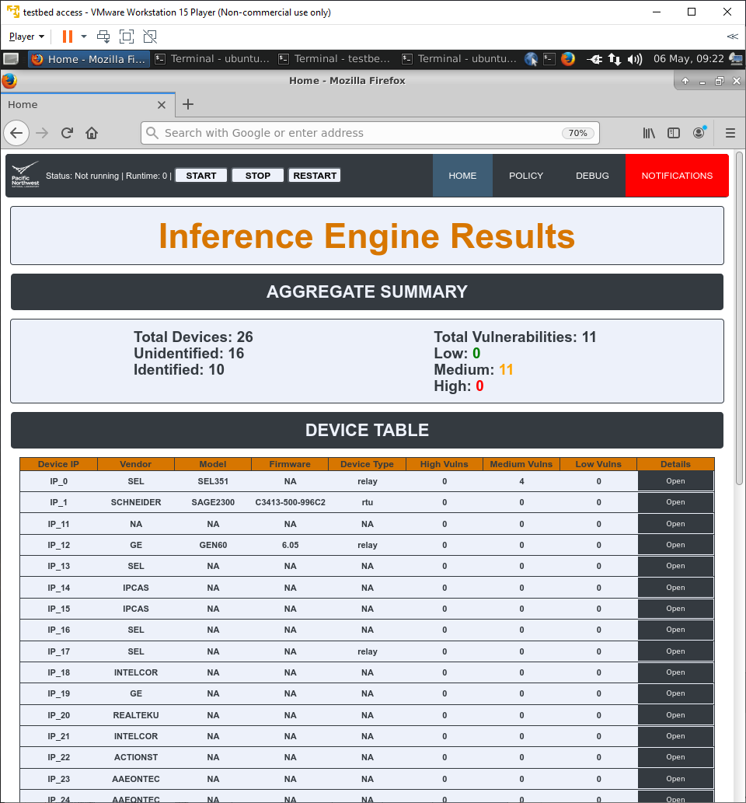
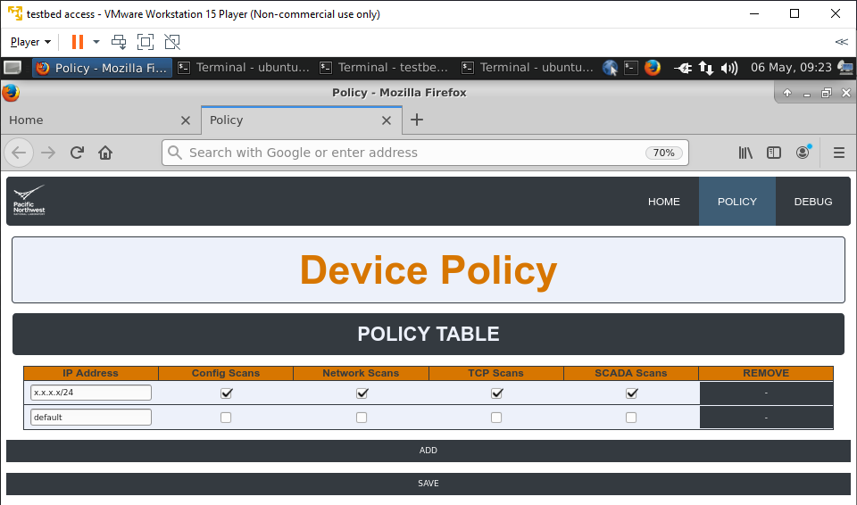

# Safe Secure Autonomous Scanning Solution for Energy Delivery Systems (SSASSE)

SSASSE tool is a device identification and vulnerability discovery tool for energy delivery systems. Our prototype tool
includes a combination of passive network traffic analysis and active scanning techniques that perform asset enumeration,
identification, and vulnerability assessment on electricity, oil, and gas critical infrastructure ICS. The identified
devices and vulnerabilities discovered along with suggestions for mitigating the discovered vulnerabilities are
reported/displayed on a web interface. The user can control which scans are safe to be triggered on their Operational
Technology (OT) devices based on scan policy settings. The goal of the tool is to intelligently trigger active scans on
to targetted devices based on a action based decision tree algorithm instead of blasting the devices with different type
 of active scans and potentially disrupting the operation of devices.

SSASSE tool consists of following components:

1. Passive Engine/Evidence Collection Engine
2. Inference Engine
3. Active Scanning Engine
4. Web Interface


{width=30%}


### Passive Scanning Engine
Passive Engine component will run on one or more sensor boxes within an operational site. It is responsible for monitoring the network traffic and collect passive evidence using passive scanning tools such as ZeeK network protocol analyser and Tenable's Nessus Network Monitor(NNM). The evidence collected is continuously fed to the inference engine for device identification analysis and vulnerability discovery.

### Inference Engine
The inference engine runs on a site coordinator box is continuously fed evidence from passive and active scanning components. It identifies unknown devices and vulnerabilities by comparing and contrasting data collected by the evidence collection engine and active scanning engine and running an action based decision tree algorithm to produce next set of actions to gain more evidence and increase probability of it being a specific device.

### Active Scanning Engine
Active Scanning Engine will run on one or more sensor boxes within an operational site. The active scanning engine uses one or more active scanning tools (for example, Tenable's Nessus Scanner) to execute the queries that the inference engine requests. The results of active scans are sent back to Inference Engine for further decision-making process.

### Web Interface
The web interface will allow the user to Start/Stop the SSASS-E platform and view the results gathered while the platform was running. 
The webpage consists of three main pages:

* Home page

The Home page contains the buttons to Start/Stop the platform as well as high level info on each IP in a Device table. 
In the Device table, there are buttons that open new pages to that IP's Details page.
There is also a button at the top right to open the Policy page. 


* Details page (specific to an IP)

Includes all evidence collected against that IP through charts, tables and timelines. 


* Policy page.

The Policy page can be used to view and edit the types of scans allowed against certain IPs or IP ranges. 

### Device Profile Generation
The SSASSE development team has created a toolset separate from the main SSASSE platform for the generation of device profiles. This tool suite will actively probe devices in a given IP range and collect network data to be parsed and integrated into the profiles that the Inference Engine uses for comparison. This tool suite is not necessary for use of the SSASSE platform itself.


## Installation Instructions

SSASSE software has three defined roles - passive, inference and active. SSASSE platform supports distributed computing environment 
where SSASSE modules (Passive Scanning, Inference and Active Scanning Engines) can run in different machines and can communicate with
each other through a common communication medium. Each machine can SSASSE platform with any combination of these
roles. The installation steps is split into instructions that are common to all machines and instructions that are
specific to the role, for example sensor box running the passive module will need Zeek (a network traffic analyzer
software), active module will need Tenable software etc. RabbitMQ is the message bus responsible for routing message
from one component to another within the platform. SSASSE platform provides secure data communication and SSL based authentication. The RabbitMQ
server can run on one of the boxes and modules in other boxes can connect to it. The RabbitMQ server and client (SSASSE modules)
need to be configured to run with SSL certificates. As a pre-requisite, the user needs to have SSL certificates handy
before following the instructions. Here is a tutorial site for generating SSL certificates for RabbitMQ:
https://www.rabbitmq.com/ssl.html#manual-certificate-generation. The CN or Common name of the commands like
"openssl req -new -key private_key.pem -out req.pem -outform PEM \    -subj /CN=$(hostname)/O=client/ -nodes" is the
hostname of the system. $(hostname) gets calculated as the hostname of the system you are running on. If you are
generating the certs on a server for another server you'll need to be careful about specifying the correct hostname.

Steps 1 - 4 need to be installed in all the machines.

### 1. Install pre-requisites

#### On debian based systems

```
sudo apt-get update
sudo apt-get install build-essential libffi-dev python3-dev python3-pip openssl libssl-dev libevent-dev git wget wireshark nmap
```

#### On centos based systems

```
sudo yum update
sudo yum install make automake gcc gcc-c++ kernel-devel python3-devel openssl openssl-devel libevent-devel git wget wireshark nmap 
```

#### Allow non-sudo users to capture packets

```
sudo chmod +x /usr/sbin/dumpcap
```

### 2. Clone SSASSE code

```sh
git clone https://stash.pnnl.gov/scm/~nidd494/evidencecollection.git
```

### 3. Install python packages required by SSASSE

```
pip3 install -r requirements.txt --user
```

### 4. Configure SSASSE by adding the following
* hostname of the the machine of RabbitMQ server
* port number of the machine of RabbitMQ server
* modules/roles that will spawned in this machine
* client SSL certificates for connecting to the RabbitMQ server
* If the machine is running inference engine, the APACHE certificates for web server is needed

Save this config file as "config.yml" in "$SSASSE_ROOT/ssasse_platform/" where SSASSE_ROOT is the root of the source folder.

```yaml
#host parameter is mandatory parameter. fully qualified domain name
rabbitmq-host: inference-2

# host parameter is mandatory parameter. fully qualified domain name
rabbitmq-port: 5671

#Unique name to the site
site-name: pacific

# Roles can be - passive, active, inference, all
roles: 
  - passive
  - inference

# IP information
# ip should reflect the ip address assigned to this box
# internal_ip_range is the range of ip addresses that are considered to be within the internal network to the inference engine. Only required on the machine running the Inference Engine. 
ip: 192.x.x.x
internal-ip-range: 192.x.x.x/x

# Path to SSL client certificates for connecting to RabbitMQ server
rabbitmq-certificates:
  ca-file: "/home/centos/client2/ca_certificate.pem"
  public-cert: "/home/centos/client2/client2_certificate.pem"
  private-key: "/home/centos/client2/client2_private_key.pem"

# Path to APACHE certificates for https webpage and flask API
# Only required on the machine running the Inference Engine
apache-certificates:
  public-cert: /etc/pki/tls/certs/apache_ca.crt
  private-key: /etc/pki/tls/private/apache_ca.key

```

### 5. RabbitMQ installation

RabbitMQ server does not need to be installed in every sensor box. The server can be installed in one machine and SSASSE
installations in other sensor boxes can connect to it. RabbitMQ server runs with SSL based authenticated connection, so
it needs SSL Certificate Authority certificate, server public certificate and server private key. RabbitMQ server is
then configured to run with these certificates.

#### Run below script to install RabbitMQ server and it's dependencies and configure RabbitMQ for SSASSE.

```sh
sudo ./ssasse_platform/scripts/utils/install_rabbit.sh <os> <version> <path to CA certificate> <path to server public certificate> <path to server private key>
```
Here, the os can be 'debian' or 'centos'. And the version for 'debian' based systems can be 'bionic', trusty' etc.
The version names for centos can be '6', '7' or '8'.

#### Check the status of RabbitMQ

```
~/rabbitmq-server/rabbitmq_server-3.7.7/sbin/rabbitmqctl status
```
A sample output would look like below:

```
Status of node rabbit@centos ...
[{pid,5322},
 {running_applications,
     [{rabbitmq_management,"RabbitMQ Management Console","3.7.7"},
      {rabbitmq_management_agent,"RabbitMQ Management Agent","3.7.7"},
      {amqp_client,"RabbitMQ AMQP Client","3.7.7"},
      {rabbitmq_web_dispatch,"RabbitMQ Web Dispatcher","3.7.7"},
      {rabbitmq_auth_mechanism_ssl,
          "RabbitMQ SSL authentication (SASL EXTERNAL)","3.7.7"},
      {rabbit,"RabbitMQ","3.7.7"},
      {rabbit_common,
          "Modules shared by rabbitmq-server and rabbitmq-erlang-client",
          "3.7.7"},
      {ranch_proxy_protocol,"Ranch Proxy Protocol Transport","1.5.0"},
      {cowboy,"Small, fast, modern HTTP server.","2.2.2"},
      {ranch,"Socket acceptor pool for TCP protocols.","1.5.0"},
      {ssl,"Erlang/OTP SSL application","9.4"},
      {public_key,"Public key infrastructure","1.7"},
      {asn1,"The Erlang ASN1 compiler version 5.0.9","5.0.9"},
      {recon,"Diagnostic tools for production use","2.3.2"},
      {os_mon,"CPO  CXC 138 46","2.5.1"},
      {inets,"INETS  CXC 138 49","7.1.1"},
      {jsx,"a streaming, evented json parsing toolkit","2.8.2"},
      {cowlib,"Support library for manipulating Web protocols.","2.1.0"},
      {xmerl,"XML parser","1.3.22"},
      {crypto,"CRYPTO","4.6.2"},
      {mnesia,"MNESIA  CXC 138 12","4.16.1"},
      {lager,"Erlang logging framework","3.6.3"},
      {goldrush,"Erlang event stream processor","0.1.9"},
      {compiler,"ERTS  CXC 138 10","7.4.9"},
      {syntax_tools,"Syntax tools","2.2.1"},
      {syslog,"An RFC 3164 and RFC 5424 compliant logging framework.","3.4.2"},
      {sasl,"SASL  CXC 138 11","3.4.1"},
      {stdlib,"ERTS  CXC 138 10","3.10"},
      {kernel,"ERTS  CXC 138 10","6.5"}]},
 {os,{unix,linux}},
 {erlang_version,
     "Erlang/OTP 22 [erts-10.5.6] [source] [64-bit] [smp:4:4] [ds:4:4:10] [async-threads:64]\n"},
..........................
```

### 6. Passive module specific installation

This is required on the sensor box is running passive scanning engine

#### Install Bro/Zeek

##### Install Zeek and it's dependencies

Follow Zeek installation steps as per https://docs.zeek.org/en/current/install/install.html.

On RHEL/Red Hat based Linux/Centos7:

Install the pre-requisite packages for zeek.

```sh
sudo yum install cmake make gcc gcc-c++ flex bison libpcap-devel openssl-devel python3 python3-devel swig zlib-devel
```

Additionally, on RHEL/CentOS 7, you can install and activate a devtoolset to get access to recent GCC versions.
You will also have to install and activate CMake 3. For example:

```sh
sudo yum install cmake3 devtoolset-7
scl enable devtoolset-7 bash
```
Check the GCC version, it should be > 7.

```sh
gcc --version
```

On DEB/Debian based Linux:

Install the pre-requisite packages for zeek.

```sh
sudo apt-get update
sudo apt-get install cmake make gcc g++ flex bison libpcap-dev libssl-dev python3 python3-dev swig zlib1g-dev
```

##### Clone Zeek source

Run the following command from $HOME.

```sh
git clone --recursive https://github.com/zeek/zeek
```

##### Build and install from source

```sh
cd $HOME/zeek
./configure --prefix=$HOME/zeek-install
make
make install
```

Please note, installation path can be any non-sudo path.

##### Install Zeek broker

Zeek broker is used transfer notifications/events to SSASSE tool whenever a new network packet is observed

###### Clone Zeek broker code

Run the following command from $HOME.

```
git clone --recursive https://github.com/zeek/broker.git
```

###### Build and install from source

```
cd $HOME/broker
./configure --prefix=$HOME/zeek-install --python-prefix=$(python -c 'import sys; print(sys.exec_prefix)')
make
sudo make install
```

Please note, installation path can be any non-sudo path.

#### Configure network interface to listen for passive data traffic

The user needs to know the network interface on which the passive network traffic will be available. For example, 'eth0'.

Open $HOME/zeek-install/etc/node.cfg and replace interface 'eth0' with the interface pertaining to yur setup.

```
[zeek]
type=standalone
host=localhost
interface=eth0
```

###### Start/Stop/Check status of zeek

To start Zeek for the first time
```
sudo $HOME/zeek-install/bin/zeekctl deploy
```

Start Zeek
```
sudo $HOME/zeek-install/bin/zeekctl start
```

Check status of Zeek
```
$HOME/zeek-install/bin/zeekctl status
```

To stop zeek
```
$HOME/zeek-install/bin/zeekctl status
```

To troubleshoot
```
$HOME/zeek-install/bin/zeekctl diag
```

### 7. Active module specific installation

This following are required on the sensor box if the active scanning engine role is intended for the sensor node. 
NOTE: The current implemenation of SSASS-E uses Tenable as an underlying scanning tool. The plan is to allow the user to choose the scanning tool they want such as Tenable, OpenVAS, or otherwise, depending on what is wanted/available. 

#### (Required only if Tenable is going to be used) Install Tenable.sc for active scanning

Follow the guidance here to install Tenable.sc: https://docs.tenable.com/tenablesc/5_16/Content/Install.htm#Before-you-begin:

#### (Required only if Tenable is going to be used) Install Tenable Nessus Scanners
 
Follow the guidance here to install Nessus on each active scanner: https://docs.tenable.com/tenableio/vulnerabilitymanagement/Content/AdditionalResources/InstallNessusScannerLinux.htm

#### (Required only if Tenable is going to be used) Configure Tenable.sc

##### (Required only if Tenable is going to be used) Configure Tenable.sc port

	1. Open the following file in your editor of choice:
		# /opt/sc/support/conf/vhost.conf

	2. Change the port from 443 to your preferred port in the Listen 443 and <VirtualHost_default_:443> settings.  In the following example the settings are changed to port 9943:
 
		Listen 9443
	
		<VirtualHost _default_:9443>
		RewriteEngine on
		RewriteOptions Inherit
		Include conf/vhostsettings.conf
		Include conf/vhostssl.conf

		...

		</VirtualHost>

	3. Restart the Tenable.sc service.

		# systemctl restart SecurityCenter

##### (Required only if Tenable is going to be used) Configure Tenable.sc to use the Nessus Scanner(s)

Using a web browser navigate to https://<IP_of_Tenable.sc_host>:9443

Upload and activate the license using the provided license file

Step through the installation wizard supplying the active scanner information when appropriate

Follow the guidance in the "Nessus Scanners" section of https://docs.tenable.com/tenablesc/5_16/Content/PDF/Tenablesc_UserGuide.pdf to add additional scanners

!NOTE: These settings can all be edited later

##### (Required only if Tenable is going to be used) Create custom plugins and scans in Tenable.sc

necessary files are in "tenable_components"

	1. Upload custom plugin tcp_synack.tar.gz to Tenable.sc
	2. Upload the *.xml policies to Tenable.sc
	3. Create an active scan per policy via the web interface

#### (Required only if Tenable is going to be used) Configure SSASS-E platform to use new Tenable installation

##### 1. Edit ssasse_platform/ActiveScanningEngine/config.json

Configure the IP, port, interface, and credentials for the new installation of Tenable.sc

Example config.json:

	{
	    "tenable_ip": "<IP>",
        "tenable_port": 9443,
        "tenable_username": "chelan",
        "tenable_password": "ssasserocks2020!",
        "scanning_interface": "enp1s0"
	}

##### 2. Edit ssasse_platform/ActiveScanningEngine/nessus_scans/nessus_scans.py

Edit the scan ID in the following scans: 

	* dnp3_TCP_header_probe
	* modbus_TCP_header_probe 
	* http_TCP_header_scan
	* snmp_device_info

The lines that need to be edited are like the following (edit "1" to the appropriate value:

	* sc.scans.edit(1, targets=[kwargs['TARGET_IPADDR']])
	* running = sc.scans.launch(1)

### 8. Inference Engine specific installation

This is required on the machine running inference engine.

#### 8.1) Apache2 - Install and Configure (CentOS)

using: https://www.digitalocean.com/community/tutorials/how-to-install-the-apache-web-server-on-centos-7

##### 1) install
```
sudo yum update httpd
sudo yum install httpd

sudo firewall-cmd --permanent --add-service=http
sudo firewall-cmd --permanent --add-service=https
sudo firewall-cmd --reload
```

##### 2) verify
```
sudo systemctl start httpd
sudo systemctl status httpd
```


##### 3) setup virtual hosts
```
sudo mkdir -p /var/www/ssasse.com/;
sudo mkdir -p /var/www/ssasse.com/log;
sudo chown -R $USER:$USER /var/www/ssasse.com/;
sudo chmod -R 755 /var/www;
```

```
sudo mkdir /etc/httpd/sites-available /etc/httpd/sites-enabled;
```

###### edit httpd.conf
```
sudo nano /etc/httpd/conf/httpd.conf
```
###### add to bottom:
```
IncludeOptional sites-enabled/*.conf
```

###### create/edit ssasse.com.conf
```
sudo nano /etc/httpd/sites-available/ssasse.com.conf
```


###### full contents of file:
```
<VirtualHost *:80>
    ServerName www.ssasse.com
    ServerAlias ssasse.com
    DocumentRoot /var/www/ssasse.com
    ErrorLog /var/www/ssasse.com/log/error.log
    CustomLog /var/www/ssasse.com/log/requests.log combined
</VirtualHost>
```

###### create link
```
sudo ln -s /etc/httpd/sites-available/ssasse.com.conf /etc/httpd/sites-enabled/ssasse.com.conf
```

##### 4) Setup SELinux permissions
```
sudo setsebool -P httpd_unified 1;
sudo ls -dZ /var/www/ssasse.com/log/;
sudo semanage fcontext -a -t httpd_log_t "/var/www/ssasse.com/log(/.*)?";
sudo restorecon -R -v /var/www/ssasse.com/log;
sudo ls -dZ /var/www/ssasse.com/log/;
```

##### 5) Test
```
sudo systemctl restart httpd
ls -lZ /var/www/ssasse.com/log
```

#### 8.2) Apache2 - Set up SSL certificates
using: https://wiki.centos.org/HowTos/Https

##### 1) install
```
sudo yum install mod_ssl openssl
```

##### 2) Setup SSL certs
###### Generate private key 
```
openssl genrsa -out ca.key 2048 
```

###### Generate CSR (leave default)
```
openssl req -new -key ca.key -out ca.csr
```

###### Generate Self Signed Key
```
openssl x509 -req -days 365 -in ca.csr -signkey ca.key -out ca.crt
```

###### Copy the files to the correct locations
```
cp ca.crt /home/centos/apache_certs/certs/
cp ca.key /home/centos/apache_certs/private/
cp ca.csr /home/centos/apache_certs/private/
```

###### edit ssl.conf:
```
sudo nano /etc/httpd/conf.d/ssl.conf
```
###### edit lines:
```
SSLCertificateFile /home/centos/apache_certs/certs/ca.crt
SSLCertificateKeyFile /home/centos/apache_certs/private/ca.key
```

###### Set configuration and restart
```
setsebool -P httpd_read_user_content 1
sudo systemctl restart httpd
```

##### 3) Setup virtual hosts 

###### edit ssasse.com.conf
```
sudo nano /etc/httpd/sites-available/ssasse.com.conf
```
###### full contents:
```
<VirtualHost *:80>
    ServerName www.ssasse.com
    ServerAlias ssasse.com
    DocumentRoot /var/www/ssasse.com
    ErrorLog /var/www/ssasse.com/log/error.log
    CustomLog /var/www/ssasse.com/log/requests.log combined
</VirtualHost>

<VirtualHost *:443>
        SSLEngine on
        SSLCertificateFile /home/centos/apache_certs/certs/ca.crt
        SSLCertificateKeyFile /home/centos/apache_certs/private/ca.key
        <Directory /var/www/ssasse.com>
        AllowOverride All
        </Directory>
        DocumentRoot /var/www/ssasse.com
        ServerName ssasse.com
</VirtualHost>
```

###### edit ssl.conf
```
sudo nano /etc/httpd/conf.d/ssl.conf
```
###### edit:
```
DocumentRoot "/var/www/ssasse.com"
ServerName www.ssasse.com:443
```

###### restart httpd
```
sudo systemctl restart httpd
```


##### 4) Configure firewall
```
sudo iptables -A INPUT -p tcp --dport 443 -j ACCEPT
sudo firewall-cmd --zone=public --add-port=443/tcp --permanent
sudo firewall-cmd --permanent --add-service=https
sudo firewall-cmd --reload
iptables -L -v
```

#### 8.3) Apache2 - Move SSASS-E web files over
 ```
sudo cp -r evidencecollection/ssasse_platform/InferenceEngine/Results/* /var/www/ssasse.com/
```

#### 8.4) Prepping config files for Webpage/Flask API

After the IP of the box is set and all prior install/requirements are met, the following files will need to be edited 

* evidencecollection/ssasse_platform/config.yml 
```
Edit the ip and internal_ip_range variables accordingly
```
* /var/www/ssasse.com/html/js/flaskquery.js 
```
Line 2 – the flaskURL needs to be changed to the IP of the box
If the laptop itself will be used to view the webpage, the flaskURL should be left as 127.0.0.1 
```
* ssasse_platform/InferenceEngine/Scans/policy.json 
```
This file declares which scans are allowed against which IPs. It can be edited here or on SSASS-E web page, on Policy page (recommended).
Individual IPs can be listed, or a range can be given with the 0.0.0.0/0 notation 
```
* ssasse_platform/InferenceEngine/Scans/zonemap.json 
```
Define the list of IPs that belong to substation ranges 
Individual IPs can be listed, or a range can be given with the 0.0.0.0/0 notation 
```

#### 8.5) Configuring credentials for scans against specific boxes/IPs

When configuring credentials to be used for scans for the first time, do the following:
Make sure the file ssasse_platform/InferenceEngine/Scans/creds.json is not populated.
From the root directory, run the python script configureCreds.py
```
python3 ssasse_platform/scripts/utils/configureCreds.py
```
The script will prompt you for an IP address, a username, and a password that will be used as default credentials when running a scan against that device that requires credentials.
The password is encrypted and stored in the ssasse_platform/InferenceEngine/Scans/creds.json file.
The encrypton key is saved in a file in the root directory called "credsSafe". 
If this file is moved or deleted, the Inference Engine will not be able to decrypt the password and you will have to re-configure credentials again.


### 9. Custom pyshark changes

Necessary files are in "pyshark_components"

Replace live_capture.py and capture.py in ~/.local/lib/python3.6/site-packages/pyshark/capture/ with the files in the pyshark_components" directory of the SSASS-E repo


## Executing the tool

* Login to machine running Inference Engine and go to $HOME/evidencecollection

* Start the flask API:

```
python3 flaskserver.py
```

* Connecting to the home page
In a browser, enter:

https://IP.ADDRESS.OF.MACHINE/home.html

If the machine itself is used to view the page, the IP will be 127.0.0.1

* Start/stop/restart buttons at top of home page

{width=20%}

These buttons can be used to control the platform

When clicked, they will take time to run/stop the ssass-e platform. The buttons will remain unresponsive until the background task is complete

* To validate everything is running

Status of running/not running and runtime will be visible at the top of the home page

If Runtime is 0, it is not running.

## Looking at Results

The three main pages of the SSASS-E webpage are the Home page, Details page (per IP) and Policy page. The info you will find on each:

### Home page

#### The Aggregate Summary

* Total IPs found, total IPs identified vs unidentified

* Total vulnerabilities, high/med/low count

#### Device table

* Includes high level details such as vendor, model, firmware, etc.



### Details page

Each entry on the Device table will have a button that opens a new page to that IP’s Details page.


The details page will include, if available through inference:

* Similarity charts

* Vulnerability table

* Identification and Vulnerability Timelines


### Policy page

From the Home page, clicking the POLICY button in the top right will open the Policy page



It will show the IP vs Scan policy table


## Troubleshooting

Login to each of the sensor boxes and navigate to ‘$HOME/evidencecollection/’ path. Tail the ssasse.log to find errors


## Support

Please contact the following for any queries or support:

Thomas W Edgar (thomas.edgar@pnnl.gov)

## Publications

Edgar T.W., S. Niddodi, T.R. Rice, W.J. Hofer, G.E. Seppala, K.M. Arthur-Durett, and M. Engels, et al. 2019. "Safer and optimized vulnerability scanning for operational technology through integrated and automated passive monitoring and active scanning." Journal of Information Warfare 18, no. 4 (Special Edition):125-155. PNNL-SA-145717.

## License

This project is licensed under the BSD License, see LICENSE file for details.
